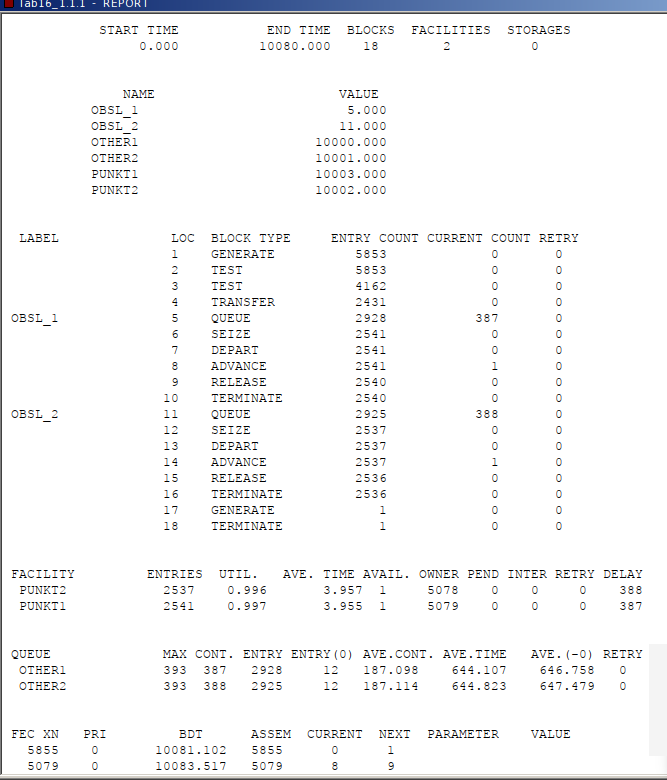
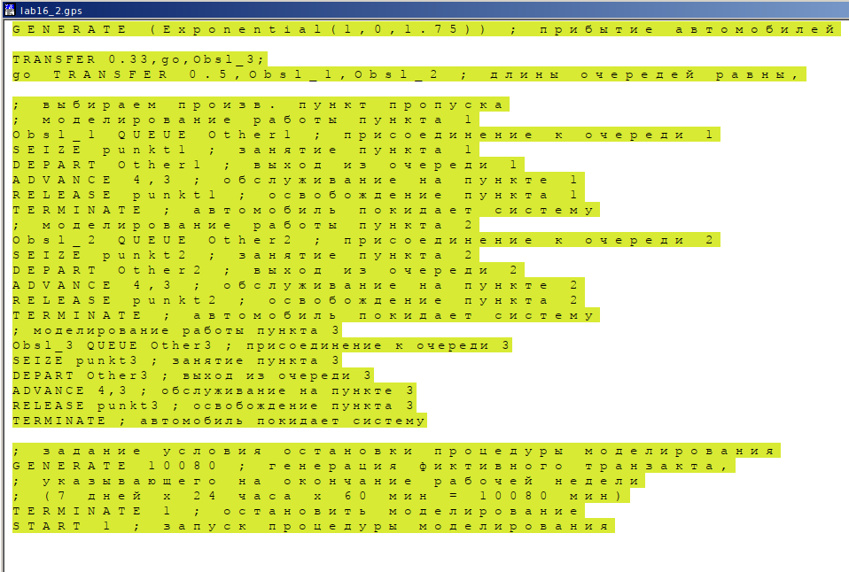
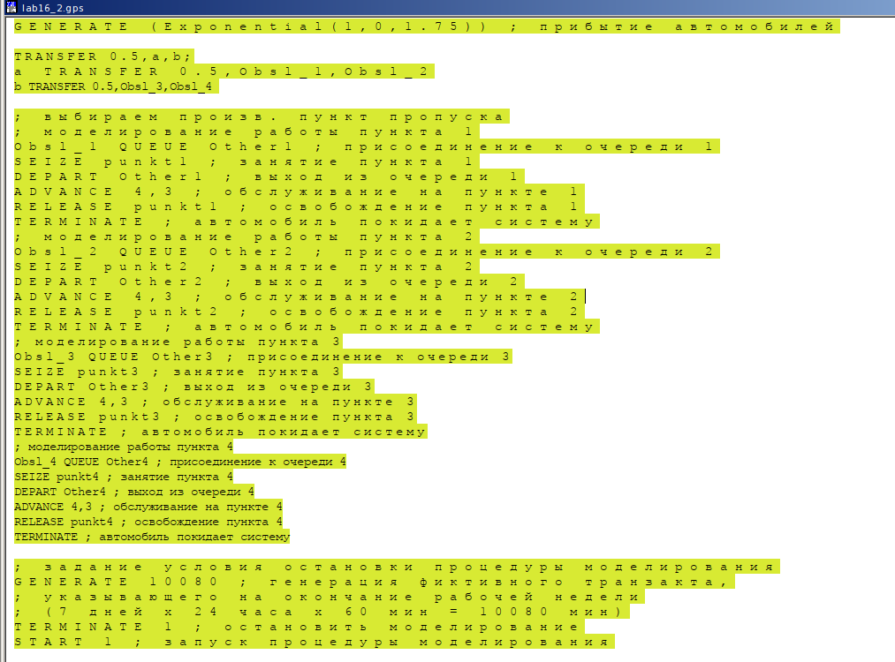
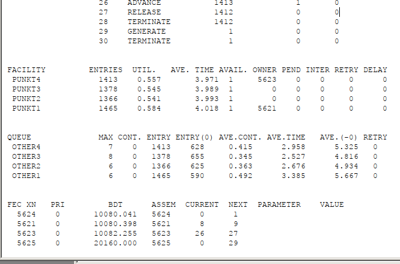
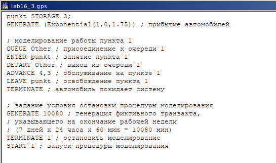
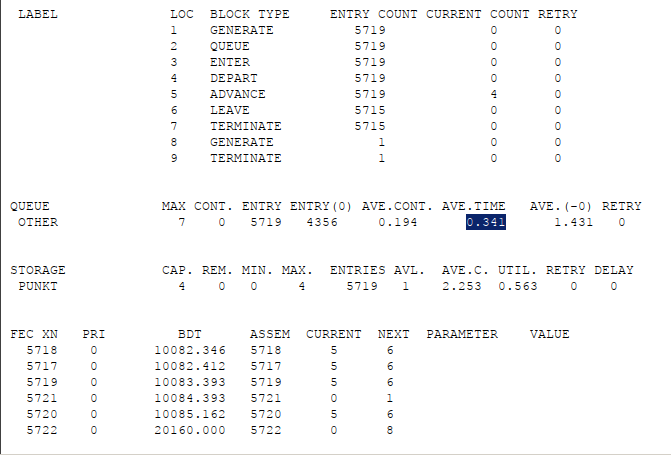

---
## Front matter
lang: ru-RU
title: Лабораторная работа 16
subtitle: Задачи оптимизации. Модель двух стратегий обслуживания
author:
  - Кадирова М. Р.
institute:
  - Российский университет дружбы народов, Москва, Россия

## i18n babel
lang: ru-RU

## Formatting pdf
toc: false
toc-title: Содержание
slide_level: 2
aspectratio: 169
section-titles: true
theme: metropolis
header-includes:
 - \metroset{progressbar=frametitle,sectionpage=progressbar,numbering=fraction}
 - '\makeatletter'
 - '\beamer@ignorenonframefalse'
 - '\makeatother'
---

# Информация

## Докладчик

:::::::::::::: {.columns align=center}
::: {.column width="70%"}

  * Кадирова Мехрубон Рахматжоновна
  * студентка
  * Российский университет дружбы народов
  * [1032225537@pfur.ru](mailto:1032225537@pfur.ru)
  * <https://github.com/KMehrubon/IM/>

:::
::: {.column width="25%"}

:::
::::::::::::::

## Цель работы

Реализовать с помощью gpss модель двух стратегий обслуживания и оценить оптимальные параметры.

## Задание

Реализовать с помощью gpss:

- модель с двумя очередями;
- модель с одной очередью;
- изменить модели, чтобы определить оптимальное число пропускных пунктов.

# Выполнение лабораторной работы

## Постановка задачи

На пограничном контрольно-пропускном пункте транспорта имеются 2 пункта
пропуска. Интервалы времени между поступлением автомобилей имеют экспоненциальное распределение со средним значением $\mu$. Время прохождения автомобилями
пограничного контроля имеет равномерное распределение на интервале $[a, b]$.
Предлагается две стратегии обслуживания прибывающих автомобилей:

1) автомобили образуют две очереди и обслуживаются соответствующими пунктами
пропуска;
2) автомобили образуют одну общую очередь и обслуживаются освободившимся
пунктом пропуска.
Исходные данные: $\mu$ = 1, 75 мин, $a$ = 1 мин, $b$ = 7 мин.

## Построение модели

{#fig:001 width=50%}

## Построение модели

{#fig:002 width=40%}

## Построение модели

{#fig:003 width=70%}

## Построение модели

{#fig:004 width=50%}

## Построение модели

: Сравнение стратегий

| Показатель                 | стратегия 1 |         |          |  стратегия 2 |
|----------------------------|-------------|---------|----------|--------------|
|                            | пункт 1     | пункт 2 | в целом  |              |
| Поступило автомобилей      | 2928        | 2925    | 5853     | 5719         |
| Обслужено автомобилей      | 2540        | 2536    | 5076     | 5049         |
| Коэффициент загрузки       | 0,997       | 0,996   | 0,9965   | 1            |
| Максимальная длина очереди | 393         | 393     | 786      | 668          |
| Средняя длина очереди      | 187,098     | 187,114 | 374,212  | 344,466      |
| Среднее время ожидания     | 644,107     | 644,823 | 644,465  | 607,138      |

## Оптимизация модели двух стратегий обслуживания

{#fig:005 width=70%}

## Оптимизация модели двух стратегий обслуживания

{#fig:006 width=50%}

## Оптимизация модели двух стратегий обслуживания

{#fig:007 width=70%}

## Оптимизация модели двух стратегий обслуживания

{#fig:008 width=45%}

## Оптимизация модели двух стратегий обслуживания

{#fig:009 width=60%}

## Оптимизация модели двух стратегий обслуживания

{#fig:010 width=70%}

## Оптимизация модели двух стратегий обслуживания

{#fig:011 width=70%}

## Оптимизация модели двух стратегий обслуживания

{#fig:012 width=50%}

## Оптимизация модели двух стратегий обслуживания

{#fig:013 width=70%}

## Оптимизация модели двух стратегий обслуживания

{#fig:014 width=70%}

## Выводы

В результате выполнения данной лабораторной работы я реализовала с помощью gpss:

- модель с двумя очередями;
- модель с одной очередью;
- изменить модели, чтобы определить оптимальное число пропускных пунктов.